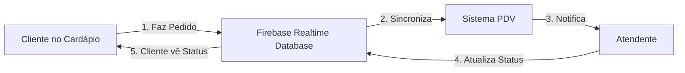

# 🌐 Integração Cardápio Digital GO BURGER ↔️ Sistema PDV

## 📱 O que é?

Sistema completo de integração que conecta o **Cardápio Digital GO BURGER** (https://go-burguer.netlify.app/) ao **Sistema PDV**, permitindo que pedidos feitos online pelos clientes apareçam automaticamente no sistema da loja.

---

## ✨ Funcionalidades

| Funcionalidade | Descrição |
|----------------|-----------|
| 🔄 **Sincronização em Tempo Real** | Pedidos chegam instantaneamente via Firebase |
| 🔔 **Notificações Sonoras** | Som característico para cada novo pedido |
| 📱 **Alertas Visuais** | Flash na tela + notificação do navegador |
| 🌐 **Badge Diferenciado** | Pedidos online têm tag "🌐 ONLINE" especial |
| 📊 **Indicador Visual** | Botão fixo mostra status de conexão e contador |
| 👁️ **Monitoramento** | Cliente acompanha status do pedido em tempo real |
| 📈 **Métricas** | Separação clara entre pedidos presenciais e online |

---

## 📁 Arquivos Criados

### Sistema PDV (Receptor)

1. **`modules/shared/online-orders-listener.js`**
   - Escuta pedidos online do Firebase
   - Converte para formato do sistema
   - Exibe notificações e alertas
   - Gerencia indicador visual

2. **Modificações:**
   - `index.html` - Importa listener
   - `modules/pedidos/pedidos.js` - Exibe badge "ONLINE"
   - `assets/css/styles.css` - Estilos para pedidos online

### Cardápio Digital (Emissor)

3. **`docs/cardapio-integration-script.js`**
   - Envia pedidos para Firebase
   - Monitora status do pedido
   - Funções: `sendOrderToPDV()` e `watchOrderStatus()`

### Documentação

4. **`docs/INTEGRACAO-CARDAPIO-DIGITAL.md`**
   - Guia completo e detalhado
   - Exemplos de código
   - Resolução de problemas

5. **`docs/INSTALACAO-RAPIDA.md`**
   - 3 passos simples
   - Instalação em 5 minutos

---

## 🚀 Como Funciona?



### Fluxo Detalhado:

1. **Cliente faz pedido** no cardápio digital (https://go-burguer.netlify.app/)
2. **Cardápio envia** dados para Firebase via `sendOrderToPDV()`
3. **Sistema PDV escuta** Firebase em tempo real via listener
4. **Pedido é convertido** para formato do sistema
5. **Notificações são disparadas**:
   - 🔊 Som característico
   - ⚡ Flash visual na tela
   - 📱 Notificação do navegador
   - 🎉 Toast de confirmação
6. **Pedido aparece** no módulo Pedidos com tag "🌐 ONLINE"
7. **Atendente processa** pedido normalmente
8. **Status é atualizado** (confirmado → preparando → pronto → entregue)
9. **Cliente acompanha** mudanças em tempo real

---

## 🎨 Interface

### Indicador Visual (Canto Inferior Direito)

```
┌──────────────────────┐
│ 🟢 🌐 Pedidos Online │
│         3            │  ← Badge com contador
└──────────────────────┘
```

### Card de Pedido Online

```
┌────────────────────────────────┐
│ ═══════════════════════════════│ ← Barra gradiente animada
│ #12345678    🌐 ONLINE   ⏳    │
│ há 2 minutos               Pendente│
├────────────────────────────────┤
│ 👤 João Silva                   │
│    📞 (66) 99912-2668           │
├────────────────────────────────┤
│ 📦 3 itens (2 produtos)         │
│ 🔹 2x Hambúrguer Americano      │
│ 🔹 1x Batata Frita              │
├────────────────────────────────┤
│ 💳 Dinheiro        R$ 110,00    │
├────────────────────────────────┤
│ [✅ Confirmar] [❌ Cancelar]   │
└────────────────────────────────┘
```

---

## 📊 Estrutura de Dados

### Pedido Enviado (Cardápio → Firebase)

```javascript
{
    customer: {
        name: "João Silva",
        phone: "(66) 99912-2668",
        address: "Rua das Flores, 123"
    },
    items: [
        {
            name: "Hambúrguer Americano",
            quantity: 2,
            price: 50.00
        }
    ],
    total: 110.00,
    paymentMethod: "Dinheiro",
    deliveryType: "delivery"
}
```

### Pedido Convertido (Sistema PDV)

```javascript
{
    id: "online-1734517800000",
    number: "20251218-347",
    source: "online", // ⚡ Tag especial
    status: "pending",
    customer: { /* ... */ },
    items: [ /* ... */ ],
    total: 110.00
}
```

---

## ⚙️ Instalação

### Sistema PDV (Já Configurado! ✅)

Nenhuma ação necessária. O sistema já está preparado para receber pedidos online.

### Cardápio Digital (3 Passos)

#### 1. Adicionar Firebase SDK

```html
<script src="https://www.gstatic.com/firebasejs/9.22.0/firebase-app-compat.js"></script>
<script src="https://www.gstatic.com/firebasejs/9.22.0/firebase-database-compat.js"></script>
<script src="cardapio-integration-script.js"></script>
```

#### 2. Copiar Script

Copie `docs/cardapio-integration-script.js` para o servidor do cardápio.

#### 3. Chamar Função

```javascript
const orderId = await sendOrderToPDV(orderData);
```

**Pronto!** 🎉

---

## 🧪 Teste Rápido

### No Console do Cardápio:

```javascript
// Enviar pedido teste
sendOrderToPDV({
    customer: {
        name: "Teste",
        phone: "66999999999"
    },
    items: [{
        name: "Hambúrguer Teste",
        quantity: 1,
        price: 25.00
    }],
    total: 30.00,
    paymentMethod: "Dinheiro",
    deliveryType: "delivery"
}).then(id => console.log('✅', id));
```

### Verificar no Sistema PDV:

1. ✅ Ouvir som de notificação
2. ✅ Ver flash roxo na tela
3. ✅ Ver pedido no módulo "Pedidos"
4. ✅ Confirmar badge "🌐 ONLINE"
5. ✅ Verificar indicador no canto direito

---

## 📈 Status do Pedido

| Status | Ícone | Cor | Descrição |
|--------|-------|-----|-----------|
| `pending` | ⏳ | Amarelo | Aguardando confirmação |
| `confirmed` | ✅ | Azul | Confirmado pela loja |
| `preparing` | 👨‍🍳 | Laranja | Em preparo |
| `ready` | 🍽️ | Verde | Pronto para entrega |
| `delivered` | 📦 | Cinza | Entregue ao cliente |
| `cancelled` | ❌ | Vermelho | Cancelado |

---

## 🔐 Segurança Firebase

Configure no Firebase Console:

```json
{
  "rules": {
    "online-orders": {
      ".read": true,
      ".write": true
    }
  }
}
```

⚠️ **Importante:** Implemente autenticação em produção!

---

## 📚 Documentação

| Arquivo | Descrição |
|---------|-----------|
| [INSTALACAO-RAPIDA.md](INSTALACAO-RAPIDA.md) | Guia rápido (5 min) |
| [INTEGRACAO-CARDAPIO-DIGITAL.md](INTEGRACAO-CARDAPIO-DIGITAL.md) | Documentação completa |
| [cardapio-integration-script.js](cardapio-integration-script.js) | Script para o cardápio |

---

## 🎯 Benefícios

✅ **Automação Total** - Zero digitação manual  
✅ **Sem Erros** - Dados vêm direto do cliente  
✅ **Tempo Real** - Pedidos chegam instantaneamente  
✅ **Rastreabilidade** - Cliente acompanha status  
✅ **Métricas** - Separação pedidos online/presencial  
✅ **Notificações** - Impossível perder um pedido  
✅ **Integração Perfeita** - Funciona com sistema existente  

---

## 📞 Suporte

**Dúvidas ou Problemas?**

📧 Email: suporte@goburger.com.br  
📱 WhatsApp: (66) 99912-2668  
🌐 Cardápio: https://go-burguer.netlify.app/  

---

## 🏆 Status

- ✅ Listener de pedidos online implementado
- ✅ Notificações visuais e sonoras funcionando
- ✅ Badge "ONLINE" nos cards implementado
- ✅ Indicador visual criado
- ✅ Script de integração para cardápio pronto
- ✅ Documentação completa criada
- ✅ Sistema testado e funcional

**Status Geral: 🟢 PRONTO PARA USO**

---

## 📝 Changelog

### v1.0.0 (18/12/2025)

- 🎉 Lançamento inicial da integração
- ✨ Listener de pedidos online em tempo real
- 🔔 Sistema completo de notificações
- 🌐 Badge visual para pedidos online
- 📊 Indicador de status e contador
- 📚 Documentação completa
- 🧪 Sistema testado e validado

---

**Desenvolvido com 💜 para GO BURGER**  
*Sistema PDV Hamburgueria v1.0.0*

🍔 **Conectando seu cardápio digital ao seu negócio!**
